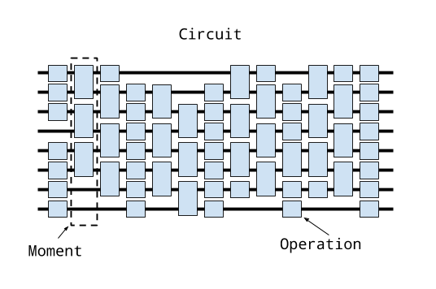

## Circuits

### Conceptual overview

There are two primary representations of quantum programs in Cirq,
each of which are represented by a class: ``Circuit`` and 
``Schedule``.  Conceptually a Circuit object is very closely 
related to the abstract quantum circuit model, while a Schedule 
object is a like the abstract quantum circuit model but includes
detailed timing information.

Conceptually: a ``Circuit`` is a collection of ``Moments``. A ``Moment``
is a collection of ``Operations`` that all act during the same
abstract time slice. An ``Operation`` is a ``Gate`` that operates
on a specific subset of ``Qubits``.


Let's unpack this.

At the base of this construction is the notion of a qubit.  In
Cirq, qubits are represented by subclasses of the ``QubitId``
base class. Different subclasses of ``QubitId`` can be used 
for different purposes.  For example the qubits that Google's
Xmon devices use are often arranged on the vertices of a 
square grid.  For this the the class ``XmonQubit``
subclasses ``QubitId``.   For example, we can create
a 3 by 3 grid of qubits using
```python
qubits = [cirq.google.XmonQubit(x, y) for x in range(3) for y in range(3)]

print(qubits[0])
# prints "(0, 0)"
```

The next level up conceptually is the notion of a ``Gate``.
A ``Gate`` represents a physical process that occurs on a 
``Qubit``.  The important property of a ``Gate`` is that it
can be applied *on* to one or more qubits.  This can be done
via the ``on`` method itself or via ``()`` and doing this
turns the ``Gate`` into an ``Operation``.
```python
# This is an Pauli X gate.
x_gate = cirq.ops.X 
# Applying it to the qubit at location (0, 0) (defined above)
# turns it into an operation.
x_op = x_gate(qubits[0])

print(x_op)
# prints "X((0, 0))"
```

A ``Moment`` is quite simply a collection of operations, each of
which operates on a different set of qubits, and which conceptually
represents these operations as occurring during this abstract time 
slice. The ``Moment`` structure itself is not required to be
related to the actual scheduling of the operations on a quantum 
computer, or via a simulator, though it can be.  For example, here
is a Moment in which Pauli X and a CZ gate operate on three qubits:
```python
cz = cirq.ops.CZ(qubits[0], qubits[1])
x = cirq.ops.X(qubits[2])
moment = cirq.circuits.Moment([x, cz])

print(moment)
# prints "X((0, 2)) and ZZ((0, 0), (0, 1))"
```
Note that is not the only way to construct moments, nor even the 
typical method, but illustrates that a ``Moment`` is just a
collection of operations on disjoint sets of qubits. 

Finally at the top level a ``Circuit`` is an ordered series
of ``Moment``s.  The first ``Moment`` in this series is, 
conceptually, contains the first ``Operations`` that will be
applied.  Here, for example, is a simple circuit made up of
two moments
```python
cz01 = cirq.ops.CZ(qubits[0], qubits[1])
x2 = cirq.ops.X(qubits[2])
cz12 = cirq.ops.CZ(qubits[1], qubits[2])
moment0 = cirq.circuits.Moment([cz01, x2])
moment1 = cirq.circuits.Moment([cz12])
circuit = cirq.circuits.Circuit((moment0, moment1))

print(cirq.circuits.to_ascii(circuit))
# prints the ascii diagram for the circuit:
# (0, 0): ---Z-------
#            |
# (0, 1): ---Z---Z---
#                |
# (0, 2): ---X---Z---
```
Again, note that this is only one way to construct a ``Circuit``
but illustrates the concept that a ``Circuit`` is an iterable
of ``Moments``.

### Constructing Circuits

Constructing ``Circuits`` as a series of ``Moments``,
each ``Moment`` hand-crafted is tedious.  Instead we provide
a variety of ways to create a ``Circuit``.

TODO


